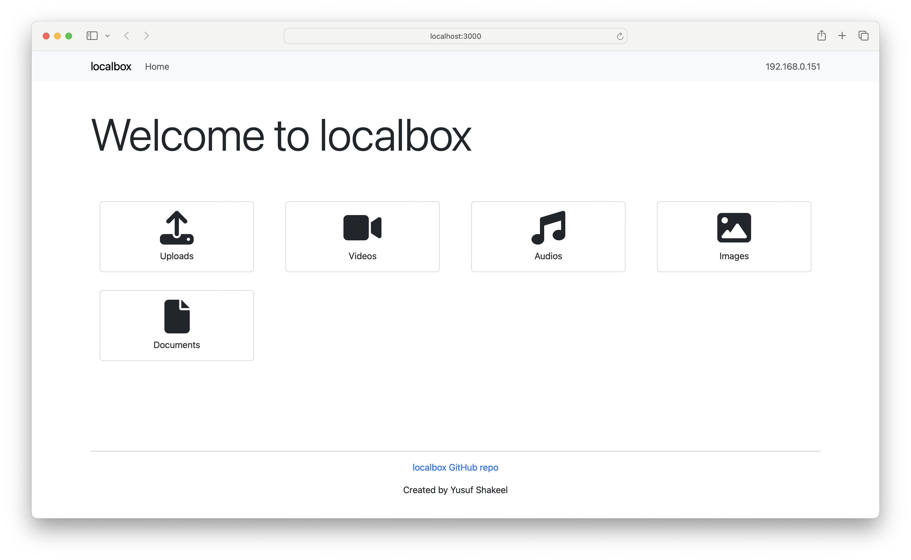
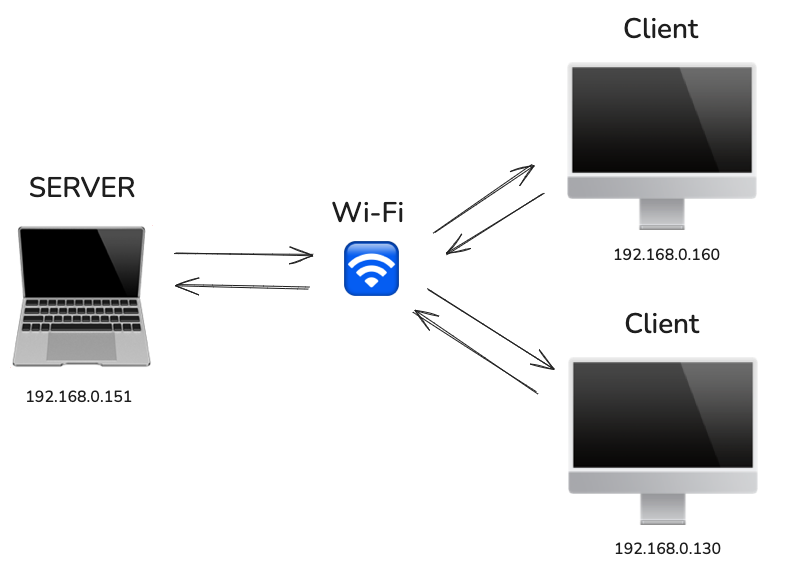

# localBox

Local box is a simple application that acts as a file storage and sharing system 
for devices connected to a given network.



## Table of Content

* [Use Case](#use-case)
* [Server Clients](#server-clients)
* [Getting Started](#server-clients)
* [License](#license)
* [Donate](#donate)

## Use Case

Imagine you’re at home or in an office:

* You can quickly share files like photos, documents, or videos between your phone and computer without using cloud services (e.g., Google Drive or Dropbox).
* Any device on the same Wi-Fi network can interact with the Local Box to upload files or retrieve hosted files.

## Server Clients

The computer that is running this application will act like the server. A local IP address (like 192.168.0.151)
will be displayed. Clients (other users) can connect to that IP address via browsers.

Make sure to add port number to the url.

If the server IP is 192.168.0.151 and is running at port 3001 then type `http://192.168.0.151:3001` in the browser.



## Getting Started

Clone this repository

```shell
git clone https://github.com/yusufshakeel/localbox.git
```

Install dependencies

```shell
npm i
```

Bootstrap

```shell
npm run bootstrap
```

Run the local server

```bash
npm run dev
```

Open [http://localhost:3000](http://localhost:3000) in the browser to see the result.

## License

It's free :smiley:

[MIT License](https://github.com/yusufshakeel/localbox/blob/main/LICENSE) Copyright (c) 2024 Yusuf Shakeel

## Donate

Feeling generous :smiley: [Donate via PayPal](https://www.paypal.me/yusufshakeel)