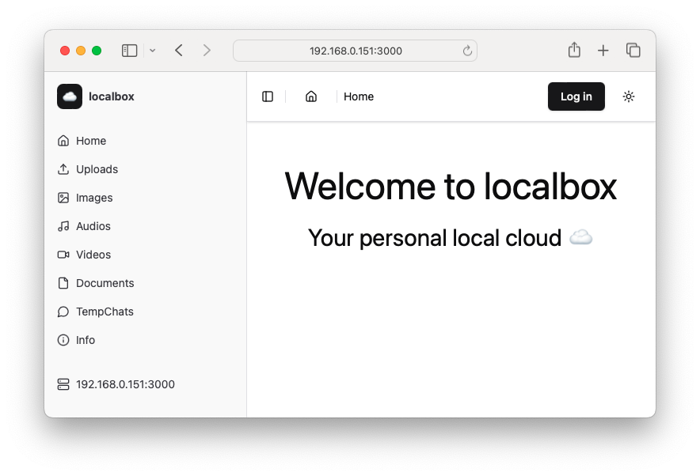

# localbox

[](https://github.com/yusufshakeel/localbox)


Turn your laptop or desktop into a personal local cloud to easily share files with 
other devices on the same Wi-Fi network.

Features:
* File upload and sharing
* Temporary Chats (TempChats)
* Audio/Video player
* User management (Authentication and Authorization)
* Dark Mode



## Table of Content

* [Use Case](#use-case)
* [Server Clients](#server-clients)
* [Minimum Requirements](#minimum-requirements)
* [Getting Started](#getting-started)
* [First time setup](#first-time-setup)
* [Rerun setup](#rerun-setup)
* [Get Updates](#get-updates)
* [Folders](#folders)
* [License](#license)
* [Donate](#donate)

## Use Case

Imagine you’re at home or in an office:

* You can quickly share files like photos, documents, or videos between your phone and computer without using cloud services (e.g., Google Drive or Dropbox).
* Any device on the same Wi-Fi network can interact with the Local Box to upload files or retrieve hosted files.

## Server Clients

The computer that is running this application will act like the server. A local IP address (like 192.168.0.151)
will be displayed. Clients (other users) can connect to that IP address via browsers.

Make sure to add port number to the url.

If the server IP is 192.168.0.151 and is running at port 3001 then type `http://192.168.0.151:3001` in the browser.

## Minimum requirements

Software:
* Node.js (version 16 or higher)
* npm
* npx

Hardware:
* Any modern/older laptop or desktop should work.
  * I am using HP ProBook 6450b laptop from the year 2010.
  * Specs:
    * 320GB HDD
    * 4GB RAM
    * Ubuntu 20.04LTS.

## Getting Started

### Clone

* Clone this repository from [GitHub](https://github.com/yusufshakeel/localbox).

```shell
git clone https://github.com/yusufshakeel/localbox.git
```

### Install dependencies

* Go inside the cloned directory and install the dependencies

```shell
npm i
```

### Bootstrap

* Now, run the following command in the terminal to bootstrap the project.

This will create files and folders that are needed by the application.

```shell
npm run bootstrap
```

### Build

* Now, build the application by running the following command in the terminal.

This will build the application.

```bash
npm run build
```

### Start the server

* You are now ready to start your localbox server.

```bash
npm run start
```

Alternatively, run the following command if you want to run the application in dev mode.

```shell
npm run dev
```

* You will see the url of the localbox application in the terminal after it starts running.

* Open the url (example [http://localhost:3000](http://localhost:3000)) in the browser.

## First time setup

* Go to Home page, and you will see localbox perform some setup operations.
* You will also get the **admin** account created.
* A `setup.lock` file will be created inside the `/private` folder.

Default credentials
```text
Username: admin
Password: root1234
```
Change the password of the **admin** account after logging in.

## Rerun setup

* Delete the `setup.lock` file from the `/private` folder.
* Run the server `npm run start` or `npm run dev`
* Open the Home page.

## Get Updates

Pull the latest **main** branch changes to your local **main** branch.

```shell
git pull origin main
```

If you are pulling a newer version then run the [install dependencies](#install-dependencies), 
[bootstrap](#bootstrap), [build](#build) and the 
[rerun setup](#rerun-setup) steps again.

## Folders

### private

This directory contains private files. Don't change anything here.

### public

This directory contains files and folders that can be viewed in browser
when you are running localbox.

### public/assets

This directory contains assets of the project. Don't change anything here.

### public/audios

Admin can upload audio files in this folder and clients will be able to download them.

### public/documents

Admin can upload document files in this folder and clients will be able to download them.

### public/images

Admin can upload image files in this folder and clients will be able to download them.

### public/uploads

Anyone can upload any files here.

### public/videos

Admin can upload video files in this folder and clients will be able to download them.

### public/temp-chats

This folder contains all the uploaded files from the TempChats.

Note: All the uploaded files via TempChats are auto-deleted.

## License

It's free :smiley:

[MIT License](https://github.com/yusufshakeel/localbox/blob/main/LICENSE) Copyright (c) 2024 Yusuf Shakeel

## Donate

Feeling generous :smiley: [Donate via PayPal](https://www.paypal.me/yusufshakeel)